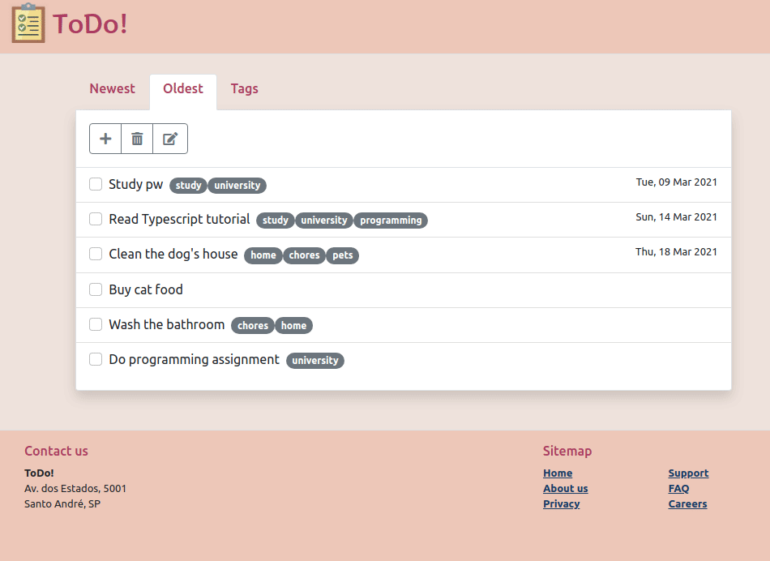
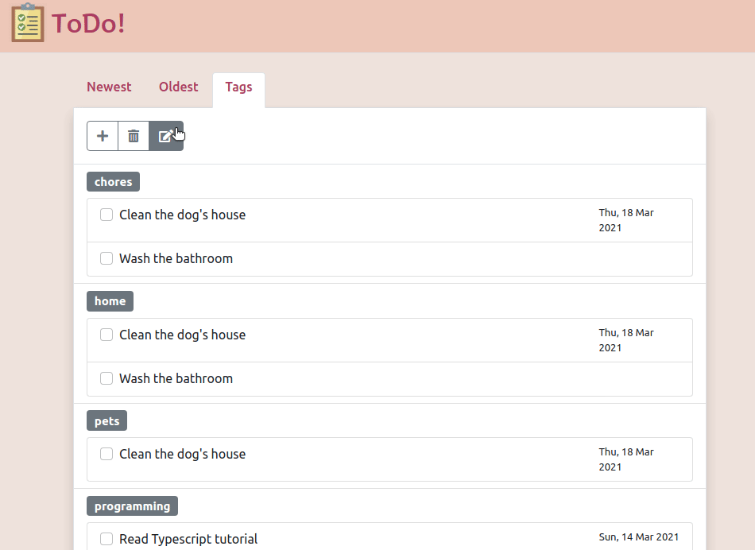

Resolução da quarta atividade prática (Single-page application) feita para a disciplina Programação para Web na UFABC.

A seguir alguns GIFs detalhando os comportamentos esperados (com a API em funcionamento).

## Aba Oldest

## Aba Tags

## Operação de edição

